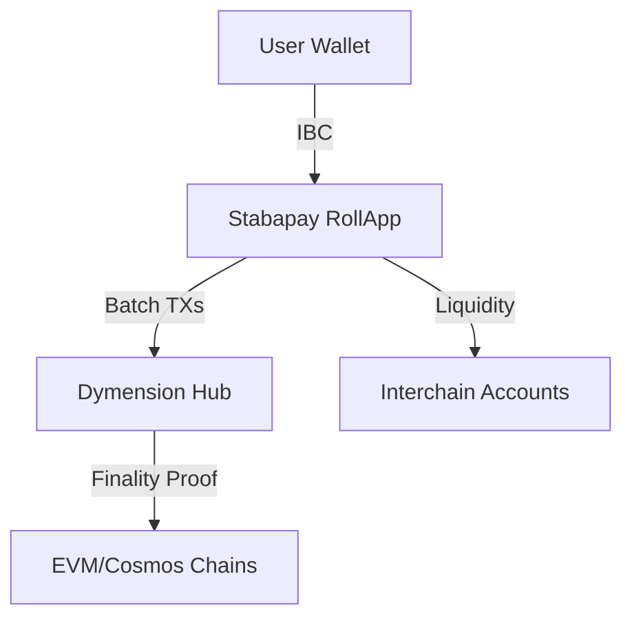

# 🌌 Stabapay

[](https://dymension.xyz)
[](https://cosmos.network)

**Enterprise-Grade Microtransaction Infrastructure**  
*Leveraging Dymension's RollApp architecture for instant settlement and unmatched scalability*

---

## 🚀 Why Stabapay? Market Disruption Potential

### 🌍 **$2.3T Opportunity** in Digital Microtransactions
- Gaming 🎮: In-app purchases, play-to-earn rewards
- Content 📽️: Pay-per-second streaming, article unlocks
- IoT 🌐: Machine-to-machine micropayments
- Social 💬: Tokenized engagement/tips

**Stabapay solves critical Web3 challenges:**  
✅ Sub-cent transaction fees  
✅ 1,000+ TPS capacity  
✅ Instant finality (<1s)  
✅ Cross-chain liquidity via IBC

---

## 🔥 Technical Edge: Dymension Superpowers

### 🧠 Intelligent Settlement Layer
| Feature                | Stabapay | Traditional L1 | L2 Solutions |
|------------------------|----------|----------------|--------------|
| **Throughput**         | 1,500 TPS| 15-30 TPS      | 200-500 TPS  |
| **Latency**            | 0.8s     | 2min-1hr       | 15-60s       |
| **Avg Fee**            | $0.0001  | $0.50-$5       | $0.01-$0.1   |
| **Settlement Finality**| Instant  | 6+ blocks      | 20min+       |

### 🛠️ Dymension RDK Integration
- **Pre-built Modules**  
  `dymint` consensus, `dymRDK` token bridge, `OPinit` fraud proofs

- **Custom Logic**  
  ```go
  func (k Keeper) ProcessMicroTx(ctx sdk.Context, tx types.MsgPay) {
      // Atomic settlement via Dymension Hub
      k.dymKeeper.FinalizeBatch(ctx, tx)
  }
  ```

---

## 💡 Core Innovations

### 🌉 IBC Liquidity Gateway
**Cross-chain microtransactions made seamless**  


1. User initiates payment on Stabapay RollApp
2. Dymension Hub settles transaction batch
3. Funds bridged via ICS-20 to any IBC chain

### ⚡ STB Token Economy
- **Fixed Supply**: 1B STB (1 STB = 1M microSTB)
- **Fee Burning**: 50% of tx fees permanently removed
- **Staking**: 15% APY for sequencer delegation

---

## 🏆 Real-World Applications

### Case Study: Cloud Gaming Platform
**Problem**: 10M daily microtransactions @ $0.50 fee = **$1.8B/yr lost**

**Stabapay Solution**:
| Metric           | Before  | After   |
|-------------------|---------|---------|
| **Avg Fee**       | $0.50   | $0.0001 |
| **Throughput**    | 250 TPS | 1,500 TPS |
| **Settlement Time** | 3min   | 0.8s    |

**Savings**: **$1.795B/yr** + new markets enabled

---

## 🧩 Technical Architecture



### Key Components
1. **Sequencer Network**: Geo-distributed nodes for low-latency
2. **Fraud Prover**: Optimistic challenge system
3. **Liquidity Pool**: Automated IBC bridging

---

## 🚀 Milestone Strategies  

### 🔹 Phase 1: Idea Validation & Developer Engagement  
- 🛠 **Prototype Development**: Build a simple MVP showcasing instant micropayments.  
- 🌍 **Open-source Repository**: Launch the codebase to attract early contributors.  
- 💡 **Developer Feedback Loop**: Gather insights from blockchain and Web3 developers.  
- 🏆 **Small-Scale Hackathons**: Engage developers to test Stabapay’s feasibility.  
- 📜 **Documentation & SDKs**: Provide easy-to-use APIs for early integrations.  

### 🔹 Phase 2: Early Adoption & Use Case Expansion  
**🎯 Target Verticals:**  
- 🎮 **Indie Game Developers**: Introduce small in-game purchases & tipping models.  
- 🎥 **Content Creators**: Partner with Web3 creators to test pay-per-use models.  
- 💼 **Freelancers & Microservices**: Enable microtransactions for small tasks & gigs.  

**📈 Growth Strategies:**  
- 🔍 **Beta Testing Program**: Invite users to test and provide feedback.  
- 🤝 **Ecosystem Collaborations**: Engage with projects in **Dymension, Cosmos, and Ethereum**.  
- 🎖 **Community Incentives**: Reward early adopters with perks (not tokens, but badges, credits, or visibility).  

### 🔹 Phase 3: Scaling & Market Adoption  
- 📱 **Mobile-friendly dApp**: Optimize for emerging markets where mobile usage is dominant.  
- 🔗 **Strategic Partnerships**: Collaborate with Web3 platforms to expand integrations.  
- 💰 **Fiat On/Off Ramp Explorations**: Research ways to bridge traditional finance for real-world adoption.  
- 🔒 **Regulatory & Security Framework**: Implement measures to ensure compliance and fraud prevention.  

---

This structured approach ensures **Stabapay** evolves from an idea 💡 to a widely adopted **Web3 micropayment solution** 💳. 🚀✨  

## 🏅 Why This Works?

1. **First-Mover Advantage**  
   Only microtransaction-optimized RollApp in Dymension ecosystem

2. **Regulatory Compliance**  
   Built-in KYC layers via Dymension's shared security

3. **Economic Flywheel**  
   📈 More users → 🌊 More liquidity → 💸 Lower fees

---

## 🌟 Get Involved

We're seeking:
- 🔧 Core Protocol Developers
- 🎮 Gaming Studio Partners
- 🌐 Liquidity Providers

**Contact**: partnerships@stabapay.io

---


